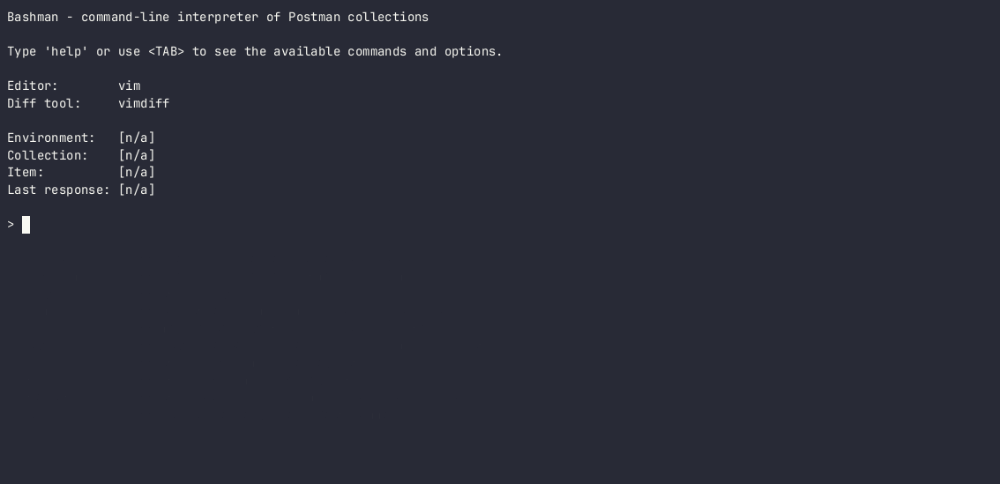

# Bashman

Bashman is a command-line interpreter of Postman collections. It parses JSON
files of collections and environments, converts them to Bash and runs using
curl.

## Prerequisites

* [bash 4+](https://www.gnu.org/software/bash/)
* [curl](https://curl.se/)
* [jq](https://github.com/jqlang/jq)
* [fzf](https://github.com/junegunn/fzf)

## Install

1. Clone the repository
2. Set and export the `BASHMAN_PATH` environment variable:
   ```
   export BASHMAN_PATH=path/to/postman/collections[:...]
   ```

## Run

```
$ cd bashman
$ ./bashman
```

## Usage



## Hints

* Bashman supports tab completion of commands, environments, collections and
  items (using `fzf`). This, however, will only work if the `BASHMAN_PATH`
   variable is set properly.
* Options passed to `run` are added to the actual `curl` command invocation,
  allowing for an _ad hoc_ modification of the request.
